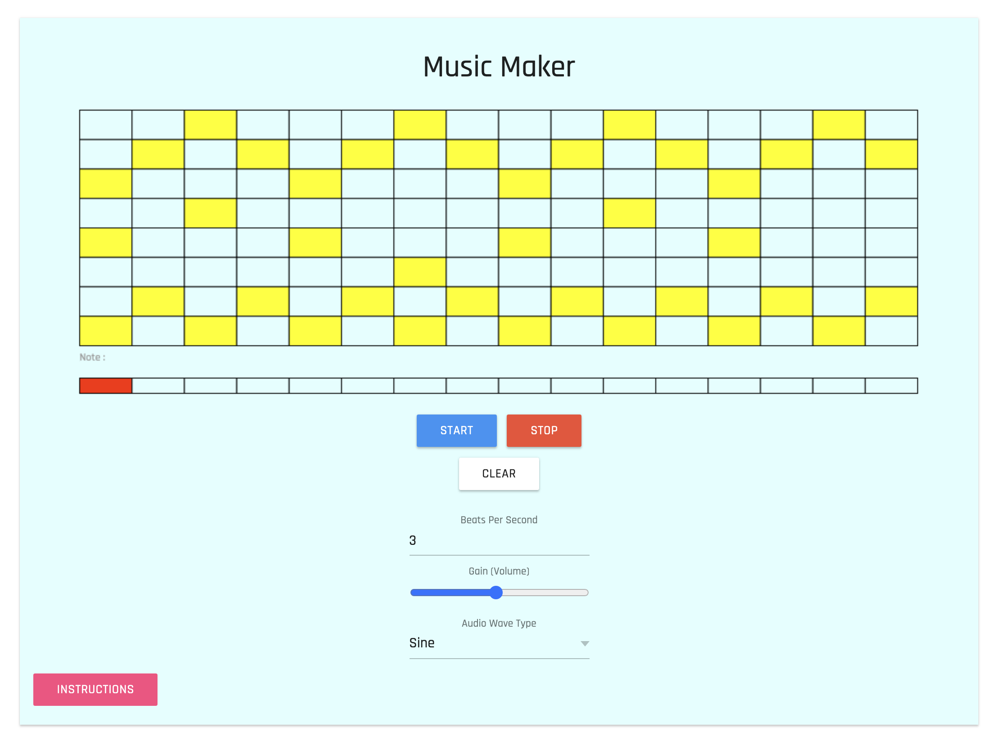

# Music Maker - Make Music in Your Browser!

https://a4-william-yang.herokuapp.com/

## Goal:
The goal of this application was to build a simple tool that would allow users to build a simple repeating song out of the notes comprising of the G major scale. As can be seen in the image, users can select parts of a grid in order to denote what notes to play in any given timestamp. Additionally, they are able to change various aspects of the song as well as change the currently playing timestamp should they wish to hear a different part of their song.

## Challenges:
I encountered several obstacles in the making of this web app, the largest of which was figuring out how the user would select which notes to play and how I would generate the sound. I solved the first obstacle by looking through Professor Roberts' InterfaceJS and using the multibutton. It provided just the right amount of control over the grid that I needed and was perfect for the task, despite not likely being made for this express purpose.

For the second obstacle I utilized the Web Audio API in order to generate sounds for the web app. While I am not an expert in music theory and frequencies, I referenced [this site](https://www.javascriptjanuary.com/blog/making-music-in-the-browser) in order to learn how to make an oscillator play a sound. While I did not use the library used in the tutorial, I created an internal json object that could be referenced to turn string notes (e.g. 'A4') into their respective frequencies (e.g. 440) that accomplished the same thing. These two solutions combined allowed me to play any note on the G major scale by simpling passing a string into a function.
