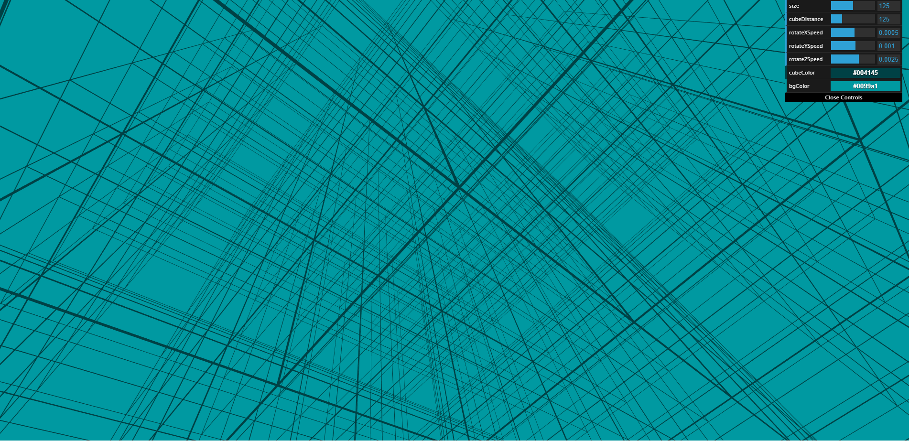
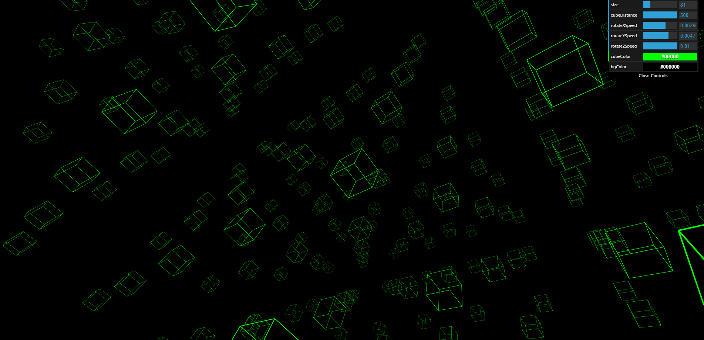
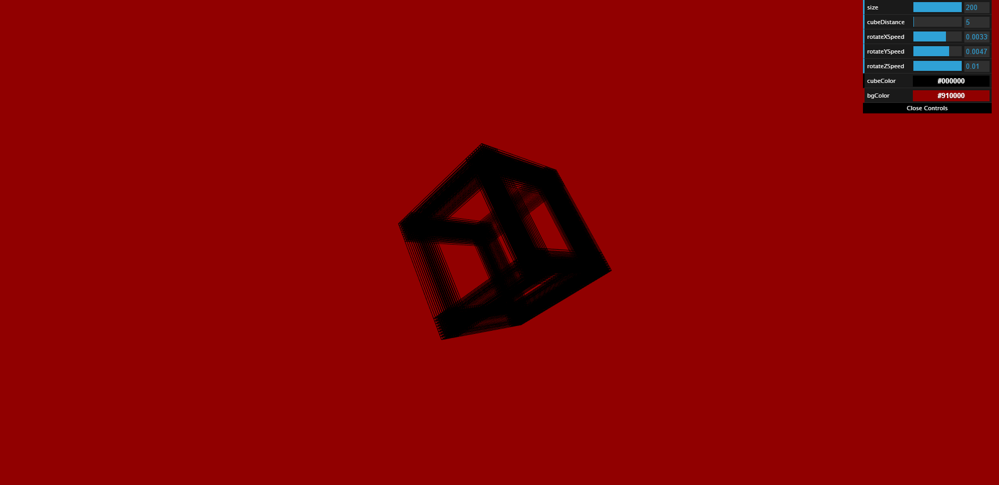

# Assignment 4: A Study in Cubes

Link: https://a4-benjamin-klaiman.glitch.me/

Include a very brief summary of your project here. Images are encouraged when needed, along with concise, high-level text. Be sure to include:

- the goal of the application
- challenges you faced in realizing the application
- the instructions you present in the website should be clear enough to use the application, but if you feel any need to provide additional instructions please do so here.

The goal of this application was to refine kowledge of JavaScript while exploring the multimedia capabilities of the web browser.
Specifically, I used p5.js to create a three-dimensional interactive array of geometry rendered by the browser. Users can alter both its appearance and movement by the
controls provided by dat.gui on the top right corner of the screen.

There were a few challenges I had to overcome in order to make this application work. While I am somewhat experienced with Processing, the programming framework that inspired
the creation of p5.js, the two are not completely identical, and because of this I needed to learn the differences between the two in order to effectively port techniques
from Processing to p5.js. 

## Technical Achivements
- I utilized stack functions for consistent three-dimensional movement and rotation.

## Design Achievements
- I implemented color selectors for the background and geometry, allowing users to customize the scene to their liking with over 1.6 million available colors for each feature.

## Images

